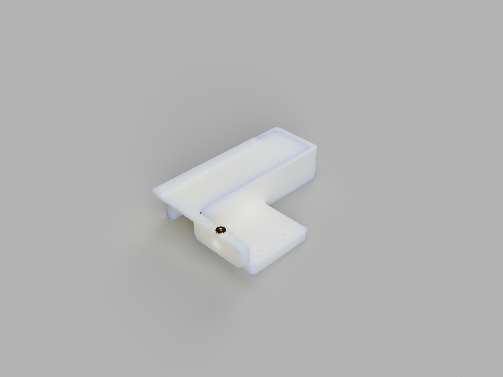

# Robo-gland
Hardware files for a simple 'robotic' rove beetle tergal gland. A small solenoid ([Adafruit 412](https://www.adafruit.com/product/412)) opens and closes the 'gland flap'. The bodies are 3D-printed, and tapped 6-32 threads secure the solenoid to the plastic base piece. A [2-56 heat-set insert](https://www.mcmaster.com/97171A110/) and set screw secures the plastic top piece to the solenoid piston. The render below does not depict the solenoid. 

